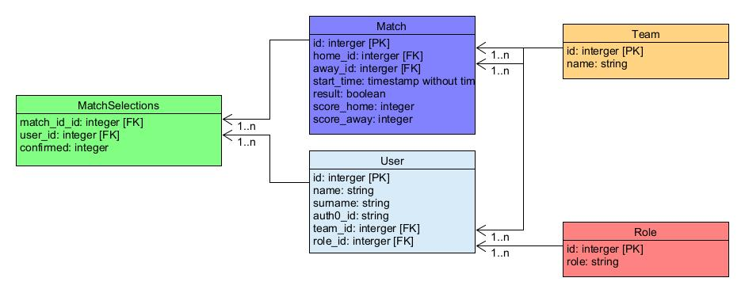

# TeamPicker

## Motivation
The purpose of TeamPicker is to provide an application that enables the management of sports teams.
Following registration, a manager must create a team during setup. 
Subsequently, players may register and must select a team during setup. 
Managers may then configure matches against other teams, and make their team selection from the list
of players registered with their team. Following selection, players may confirm their availability. 
Please see [Role functionality](#role-functionality) for additional details.

## Getting Started

### Application Layout
The application structure is as follows:
```
├─ README.md            - this file
├─ API.md               - API specification
├─ requirements.txt     - the dependencies to be installed, see Install dependencies
├─ teampicker.py        - main script
├─ src                  - backend application code
│  └─ team_picker       - application code 
│     │  ├─ auth        - authentication code
│     │  ├─ controllers - controllers for processing API requests
│     │  ├─ forms       - flask-wtf forms
│     │  ├─ models      - database ORM models
│     │  ├─ public      - javascript, css etc. files for UI
│     │  ├─ services    - service layer interfacing between controllers and database
│     │  ├─ templates   - jinja templates
│     │  └─ util        - miscellaneous application code
│     ├─ __init__.py    - application code 
│     └─ constants.py   - application constants 
├─ test                 - test scripts
│  └─ postman           - Postman collection
├─ instance             - application instance folder, to store configurations etc. outside of version control 
└─ migrations           - Flask-Migarate versions folder, to store database configurations 
```

### API
The API documentation is available in [API.md](API.md).

### Installing Dependencies

#### Python 3.9

Follow instructions to install the latest version of python for your platform in the [python docs](https://docs.python.org/3/using/unix.html#getting-and-installing-the-latest-version-of-python)

#### Virtual Environment

It is recommended that a virtual environment be used for development purposes.
Please see [Creating a virtual environment](https://packaging.python.org/guides/installing-using-pip-and-virtual-environments/#creating-a-virtual-environment) for details.

##### Terminal Window

>**Note:** The following instructions are intended to be executed from a terminal window in the project root folder,
> in which the [virtual environment is activated](https://packaging.python.org/guides/installing-using-pip-and-virtual-environments/#activating-a-virtual-environment).

##### Key Dependencies

- [Flask](http://flask.pocoo.org/) is a lightweight backend microservices framework. Flask is required to handle requests and responses.
- [SQLAlchemy](https://www.sqlalchemy.org/), [Flask-SQLAlchemy](https://flask-sqlalchemy.palletsprojects.com/en/2.x/) and [Flask-Migrate](https://flask-migrate.readthedocs.io/en/latest/) are libraries to provide database management and connectivity.
- [python-jose](https://github.com/mpdavis/python-jose) JavaScript Object Signing and Encryption for JWTs. Useful for encoding, decoding, and verifying JWTs.
- [Authlib](https://docs.authlib.org/en/latest/) and [auth0-python](https://github.com/auth0/auth0-python) provide authentication and management functionality via the [Auth0](https://auth0.com/) service. 
- [Jinja](https://jinja.palletsprojects.com/en/3.0.x/) templating engine. 
- [Bootstrap](https://getbootstrap.com/docs/5.0/getting-started/introduction/) framework. 
- [jQuery](https://jquery.com/) JavaScript library. 

#### Database schema
The following database schema has been implemented:


#### Install dependencies
Run the following command in a [Terminal Window](#terminal-window):
````shell
> pip3 install -r requirements.txt
````
Also see [Using requirements files](https://packaging.python.org/guides/installing-using-pip-and-virtual-environments/#using-requirements-files).

#### Application Configuration
The application utilises environments variables, or a combination of configuration files and environments variables to
specify the application configuration. There are three methods of configuring the application:

##### Database Configuration
The database configuration must be set in one of three different ways. In order of precedence they are:
1. Set the `DB_URI` variable to a [Connection URI](https://flask-sqlalchemy.palletsprojects.com/en/2.x/config/#connection-uri-format).
1. Set the `DB_URI_ENV_VAR` variable to the name of an environment variable which is set to a [Connection URI](https://flask-sqlalchemy.palletsprojects.com/en/2.x/config/#connection-uri-format).
    
    E.g. A typical use case is with a Heroku Postgres add-on which adds a `DATABASE_URL` environment variable that contains the database URI.

1. Set the `DB_DIALECT`,`DB_DRIVER`,`DB_USERNAME`,`DB_PASSWORD`,`DB_HOST`,`DB_PORT` and `DB_DATABASE` variables from which a [Connection URI](https://flask-sqlalchemy.palletsprojects.com/en/2.x/config/#connection-uri-format) is created.

##### .env file
* The configuration file should follow the format specified by [sample.env](instance/sample.env).

For example, to configure the application to use:
* an SQLite database file `database.db` in the [instance](instance) folder

###### Create .env file
1. Copy the file [sample.env](instance/sample.env) and save as `.env`, in the project root folder.
1. Edit the new file to set the required database and authentication configuration.
    ```
    DB_DIALECT = sqlite
    DB_DATABASE = database.db
    DB_INSTANCE_RELATIVE_CONFIG = True
   
    # Authentication related settings:
    AUTH0_DOMAIN = udacity-fsnd.auth0.com
    ALGORITHMS = ['RS256']
    AUTH0_AUDIENCE = dev
    ...
    ```
    Please see [sample.env](instance/sample.env) for additional information.

##### Configuration file
* The configuration file should follow the format specified by [sample-config.py](instance/sample-config.py).
* The environment variables determine which configuration file to load.
  * `APP_CONFIG_PATH`

    Configuration file path.

  * `INST_REL_CONFIG`

    Flag indicating if [instance_relative_config](https://flask.palletsprojects.com/en/2.0.x/api/?highlight=instance_relative_config) is relative to the [instance folder](https://flask.palletsprojects.com/en/2.0.x/config/#instance-folders).
    A setting of `f`, `false`, `n`, `no` or `0` is evaluated as *False*, otherwise the setting will be evaluated according to
    it's [truthy](https://docs.python.org/3/library/stdtypes.html#truth) value.

For example, to configure the application to use:
* a configuration file `config.py` located in the [instance](instance) folder, and
* an SQLite database file `database.db` in the [instance](instance) folder

###### Create configuration file
1. Copy the file [sample-config.py](instance/sample-config.py) and save as `config.py`, in the [instance](instance) folder.
1. Edit the new file to set the required database and authentication configuration.
    ```python
    DB_DIALECT = 'sqlite'
    DB_DATABASE = 'database.db'
    DB_INSTANCE_RELATIVE_CONFIG = True
   
    # Authentication related settings:
    AUTH0_DOMAIN = 'udacity-fsnd.auth0.com'
    ALGORITHMS = ['RS256']
    AUTH0_AUDIENCE = 'dev'
    ...
    ```
    Please see [sample-config.py](instance/sample-config.py) for additional information.

1. Set the environment variables, `APP_CONFIG_PATH` and `INST_REL_CONFIG` appropriately.

    ```shell
    For Linux and Mac:                            For Windows:
    $ export APP_CONFIG_PATH=config.py            > set APP_CONFIG_PATH=config.py
    $ export INST_REL_CONFIG=true                 > set INST_REL_CONFIG=true
    ```
##### Environment variables
Environment variables corresponding to the keys in [sample.env](instance/sample.env) and [sample-config.py](instance/sample-config.py)
should be set as appropriate.

For example, to configure the application to use:
* an SQLite database file `database.db` in the [instance](instance) folder

    ```shell
    For Linux and Mac:                            For Windows:
    $ export INST_REL_CONFIG=true                 > set INST_REL_CONFIG=true
    
    $ export DB_DIALECT=sqlite                    > set DB_DIALECT=sqlite
    $ export DB_DATABASE=database.db              > set DB_DATABASE=database.db
    $ export DB_INSTANCE_RELATIVE_CONFIG=True     > set DB_INSTANCE_RELATIVE_CONFIG=True
    
    $ export AUTH0_DOMAIN=udacity-fsnd.auth0.com  > set AUTH0_DOMAIN=udacity-fsnd.auth0.com
    $ export ALGORITHMS=['RS256']                 > set ALGORITHMS=['RS256']
    $ export AUTH0_AUDIENCE=dev                   > set AUTH0_AUDIENCE=dev
    ...
    ```
> **Note:**<br>
> For convenience, the location of the [instance folder](https://flask.palletsprojects.com/en/2.0.x/config/#instance-folders)
> has been hardcoded to [instance](instance), as the default location determined by Flask
> varies depending on whether the application or test scripts are running. Please see
> [Instance Folders](https://flask.palletsprojects.com/en/2.0.x/config/#instance-folders) for further information.

#### Application Arguments
The application supports a number of arguments:
```shell
usage: TeamPicker [-h] [-idb] [-pt] [-ga GENERATE_API]

optional arguments:
  -h, --help            show this help message and exit
  -idb, --initdb        Initialise the database, default no
  -pt, --postman_test   Disable server-side sessions, default no
  -ga GENERATE_API, --generate_api GENERATE_API
                        Generate API Markdown documentation, as specified file
```
Depending on the run method, these arguments must be passed as commandline arguments ([Run using script](#run-using-script)), or as a dictionary ([Run using Flask](#run-using-flask)).

##### Initialise the database (--initdb)
When specified the database will be initialised before use, resulting on the removal of all data.
> **Note:** This operation should not be confused with [Database Migration](#database-migration) which updates
> the database schema.

##### Disable server-side sessions (--postman_test)
When specified, server-side sessions will be disabled. This setting is necessary when running Postman requests and 
using a JWT from a user logged-in on a browser in the Postman application.  

##### Generate API markdown (--generate_api)
When specified, an API template Markdown document detailing all the application routes will be generated using the specified filename.    

#### Database Migration
Once the application is configured for a blank database, as specified in [Application Configuration](#application-configuration), 
the database must be prepared for the application as follows:

* Open a [Terminal Window](#terminal-window).
* Set environment variables as detailed in [Run the application](#run-the-application).  
* Run the command `flask db upgrade` or `python -m flask db upgrade`
    ```bash
    For Linux and Mac:
    $ export FLASK_APP=src.team_picker:create_app({})
    $ export FLASK_ENV=development
    $ flask db upgrade 
    
    For Windows:
    > set FLASK_APP=src.team_picker:create_app({})
    > set FLASK_ENV=development
    > flask db upgrade 
    ```
  This will configure the database to the state required by the application, using the script [1ed2d19c24fa_initial_migration.py](migrations/versions/1ed2d19c24fa_initial_migration.py).

#### Database Initialisation
Once the database has been migrated, it may be re-initialised by specifying the [Initialise the database (--initdb)](#initialise-the-database---initdb) application argument.
When running as a script:
```shell
For Linux and Mac:                                For Windows:
$ python teampicker.py --initdb                   > python teampicker.py --initdb
```
or passed via the `FLASK_APP` environment variable.
```bash
  FLASK_APP=src.team_picker:create_app({"initdb":True})
```

### Run the application
The application can be run using the `flask` command or directly by running the script.

Once an appropriate configuration has been created as per [Application Configuration](#application-configuration),
from a [Terminal Window](#terminal-window), run the following commands:
```bash
For Linux and Mac:                                For Windows:
$ cd /path/to/project                             > cd \path\to\project
$ export PYTHONPATH=/path/to/project/src          > set PYTHONPATH=/path/to/project/src
```
#### Run using script
From a [Terminal Window](#terminal-window), run the following commands:
```bash
For Linux and Mac:                                For Windows:
$ python teampicker.py                            > python teampicker.py
```
#### Run using `flask`
From a [Terminal Window](#terminal-window), run the following commands:
```bash
For Linux and Mac:                                For Windows:
$ export FLASK_APP=src.team_picker:create_app({}) > set FLASK_APP=src.team_picker:create_app({})
$ export FLASK_ENV=development                    > set FLASK_ENV=development
$ flask run                                       > flask run 
```
See [Run The Application](https://flask.palletsprojects.com/en/2.0.x/tutorial/factory/#run-the-application) for other operating systems.

### Test
#### Unit Test
A number of unit tests are available in the [test](#test) folder. 
The tests are performed against an in-memory sqlite database. 

From a [Terminal Window](#terminal-window), run the following commands to run all tests:
```bash
For Linux and Mac:                            For Windows:
$ cd /path/to/project/test                    > cd \path\to\project\test
$ export PYTHONPATH=/path/to/project/src      > set PYTHONPATH=/path/to/project/src
$ python -m test_all                          > python -m test_all
```

Alternatively, to run tests individually:

| Test | Command |
| ---- | ------- |
| Roles database tests | `python -m test_roles` |
| Teams database tests | `python -m test_teams` |
| Users database tests | `python -m test_users` |
| Matches database tests | `python -m test_matches` |
| Users UI tests | `python -m test_user_setup_ui` |
| Matches UI tests | `python -m test_match_ui` |

## Application Operation
Once the application has been set up as outlined in [Getting Started](#getting-started), functionality 
can be verified locally. A number of [Pre-configured users](#pre-configured-users) are available on the [Auth0](https://auth0.com/) service
as a convenience, however these users need to be configured in the application database before use. 
[User setup using Postman](#user-setup-using-postman) allows the swift completion of the setup of the
[Pre-configured users](#pre-configured-users). Alternatively, they may be setup using the process outlined
in [Additional users](#additional-users).

### Pre-configured users
The following users have been pre-configured on the [Auth0](https://auth0.com/) service:

| Email | Password | First name | Surname | Role | Team |
|-------|----------|------------|---------|------|:----:|
| m1@team1.com | Manager1! | Manny | Uno | Manager | Team 1 |
| p1@team1.com | Player1! | Patrik | Einer | Player | " |
| p2@team1.com | Player2! | Pat | Ceann | Player | " |
| p3@team1.com | Player3! | Patrice | Un | Player | " |
| m2@team2.com | Manager2! | Manfred | Dos | Manager | Team 2 |
| j1@team2.com | Player1! | Johann | Zwei | Player | " |
| j2@team2.com | Player2! | Sean | Do | Player | " |
| j3@team2.com | Player3! | Jean | Deux | Player | " |
| m3@team3.com | Manager3! | Mildred | Tres | Manager | Team 3 |
| s1@team3.com | Player1! | Joanna | Drei | Player | " |
| s2@team3.com | Player2! | Dearbhla | Triur | Player | " |
| s3@team3.com | Player3! | Jean | Trois | Player | " |

The [Auth0](https://auth0.com/) login credentials are the specified email and password. 
The first name, surname, role and team are suggestions.

#### User setup using Postman
To expedite the setup of these users on a new database, the [Postman](https://www.postman.com/) collection
[Udacity FSWD TeamPicker.postman_collection.json](test/postman/Udacity%20FSWD%20TeamPicker.postman_collection.json) is available. 
The manager user's data is available in [managers.json](test/postman/managers.json), 
and player's in [players.json](test/postman/players.json). 

##### Setup managers
* Load [Udacity FSWD TeamPicker.postman_collection.json](test/postman/Udacity%20FSWD%20TeamPicker.postman_collection.json) into Postman.
* Open the collection and select the collection `Variables` tab. 
  Set the `run_mode` variable to `iteration`, and save if necessary.   
* Select the `manager setup` folder from the collection.
* Click the `Run` button to open the Collection Runner.
* Click the `Select file` button, then browse to and select the [managers.json](test/postman/managers.json) file.
* Click the `Run Udacity FSWD TeamPicker` button, to run the requests.
* All the folder requests will run 3 times, once for each manager.
> **Note:** The requests should be run in the listed order. Failure to do so will result in incorrect user setup. 

##### Setup players
Follow the same procedure as for [Setup managers](#setup-managers), except for using the `player setup` folder from the collection,
and the [players.json](test/postman/players.json) data file.
All the folder requests will run 9 times, once for each player.

Please see [Running collections with data files](https://learning.postman.com/docs/running-collections/working-with-data-files/) for more information.

###### Individual requests in Postman collection
In order to send individual requests from [Udacity FSWD TeamPicker.postman_collection.json](test/postman/Udacity%20FSWD%20TeamPicker.postman_collection.json)
rather than the running in the listed order:
* Load [Udacity FSWD TeamPicker.postman_collection.json](test/postman/Udacity%20FSWD%20TeamPicker.postman_collection.json) into Postman.
* Open the collection and select the collection `Variables` tab.
  Set the `run_mode` variable to `individual`.
* Set the `username`,`password`,`firstname`,`surname`,`role_name` and `team_name` appropriately in order to pass response tests.  
* Save the collection variable changes.  


### Additional users
Additional users may be added as required.

* On the application home screen, click the `Login or sign-up` button.
* Select the `Sign up` link, and enter a username (email address) and password, and click `Register`.
* Authorise the application to access the user's new account.
* Enter a name and surname, and select a role on the `Create user` screen, and click `Create`.
* Manager's must enter a team name on the `Create team` screen.
* Player's must select an existing team on the `Set team` screen.

### Usage
The functionality available depends on the user's role.

#### Role functionality
| Functionality | Manager | Player  |
| ------------- |:-------:|:-------:|
| Login         | &checkmark; | &checkmark; |
| Logout        | &checkmark; | &checkmark; |
| List matches  | &checkmark; | &checkmark; |
| Search matches | &checkmark; | &checkmark; | 
| Create/update matches | &checkmark; | &cross; |
| Make match selections | &checkmark; | &cross; | 
| View match selections | &checkmark; | &checkmark; | 
| Confirm match selections | &cross; | &checkmark; | 

#### Login
On the application home screen, click the `Login or sign-up` button, and enter username and password.
Notifications for any actions which the user needs to perform are displayed on the Home screen, 
e.g., if a player need to confirm availability for a match. 
#### Logout
Click the `Logout` button on the top navigation bar.
#### List matches
Click `Matches` on the top navigation bar, and select `List` from the dropdown menu.
All the matches for the user's team will be listed.
#### Search matches
Click `Matches` on the top navigation bar, and select `Search Match` from the dropdown menu.
Enter search criteria based on opposition and/or date.
All the matches for the user's team satisfying the criteria will be listed.
#### Create/update matches
##### Create matches
Click `Matches` on the top navigation bar, and select `New Match` from the dropdown menu.
The match venue, opposition and start time must be entered.
##### Update matches
Click `Edit` button corresponding to the match in the matches listing.
The match venue, opposition, start time, score and final result values may be updated.
#### Make match selections
Click `Selections` button corresponding to the match in the matches listing.
A list of all players registered for the manager's team will be displayed. 
Click on the `Selected` checkbox to change their selected status.
#### View match selections
Click `Selections` button corresponding to the match in the matches listing.
A list of all players registered for the user's team will be displayed, 
including the confirmation status of any who have confirmed their availability.
#### Confirm match selections
Click `Selections` button corresponding to the match in the matches listing.
A list of all players registered for the player's team will be displayed.
In the event the player has been selected for the match, they can confirm their availability by
clicking on the `Confirm`, `Unsure` or `Not available` buttons.
#### JWT
Click `JWT` on the top navigation bar, to display the JWT token for the currently logged-in user.


